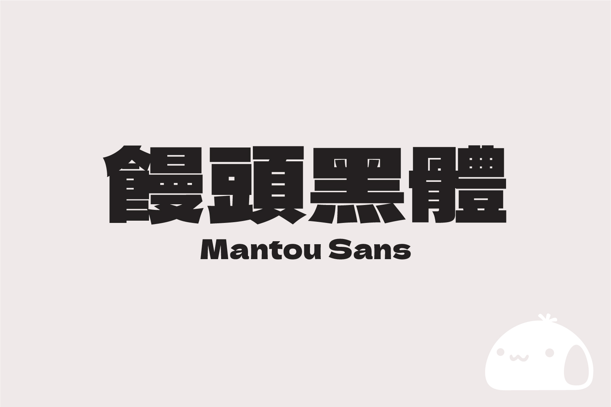
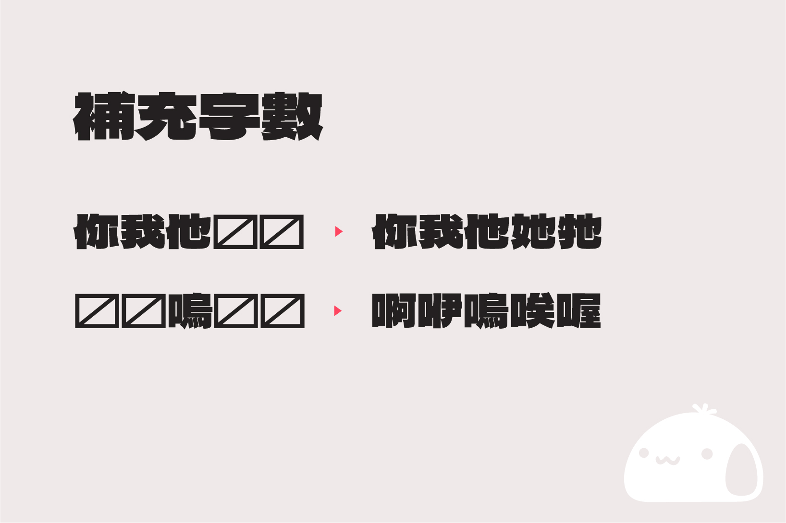
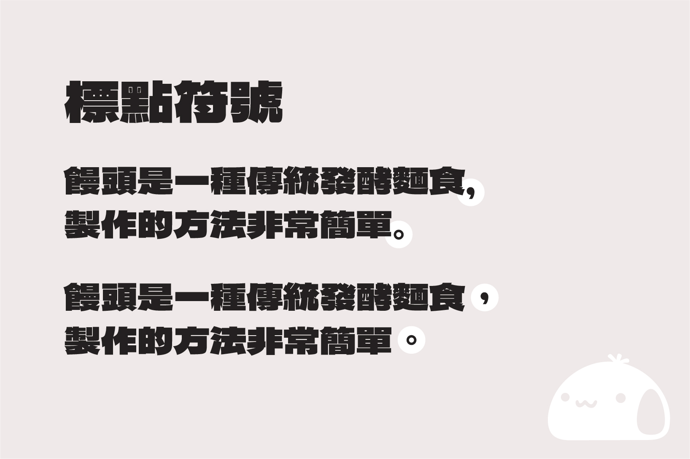

# 饅頭黑體 / MantouSans

基於字型 デラゴシック (Dela Gothic One) ，修改而成的臺灣繁體中文補充版本。

- デラゴシック 字體連結：https://github.com/syakuzen/DelaGothic/

## 簡介

由日本設計師 Artakana 於 2021 年所開源的字型「デラゴシック (Dela Gothic One / 德拉黑體)」，這是一款重量感十足的無襯線字體。其扁平且厚重的哥德式設計，不僅帶給人一種堅固穩定的感覺，更有強烈的視覺效果，特別適合用於標題、海報、影片字幕或包裝設計之中。

雖然這個字型已支援至「漢字 jis 第三水準」，但對繁體中文使用者來說，仍可能會遇到「缺字」的問題。由於我也是這套字型的愛用者，因此決定自己補齊常用的缺失字元。

## 下載與安裝

[下載字體檔 (.ttf)](https://github.com/mant0u0/MantouSans/raw/main/Font/MantouSans-Regular.ttf)

- 點擊連結進入後，即可下載檔案。
- 下載完成後，點擊開啟檔案，點擊「安裝」按鈕即可安裝。
- 安裝前請注意電腦內是否已經安裝此字型，若已安裝字型，建議先將舊版本移除後，再安裝新版本，避免字型檔讀取錯誤。

## 說明

本專案字型使用 FontCreator 14 軟體進行修改，首次發佈專案先根據字體表[常用國字標準字體表（4808 字）](https://home.gamer.com.tw/creationDetail.php?sn=5079333)，將缺少的字元根據字型現有的漢字進行拆解並且修改（首次發佈共新增 508 字）。其中，全型標點符號的部分，也針對臺灣使用習慣，調整符號的位置與寬度。

由於這是首次進行補字工作，修補的品質可能沒有到非常完美，歡迎大家提出意見，我將會盡全力改進！如果想要查看更新進度，可以參考以下連結，感謝大家～ (ㅅ´ ˘ `)♡  

[更新進度](https://github.com/mant0u0/MantouSans/blob/main/UpdateLog.md)  

（2023/11/25 更新）如果是使用簡體中文的使用者，可以嘗試使用「[标小智无界黑](https://github.com/maoken-fonts/unbounded-sans)」的版本，這個版本已經將許多簡體中文的缺字補齊了，有需要的使用者也可以嘗試看看。於 1.007 版，先使用「标小智无界黑」的注音符號補入饅頭黑體當中，避免中文注音輸入時缺字。

## 開源授權規定

- 本字型是基於 SIL Open Font License 1.1 改造自 Artakana 發佈的 Dela Gothic One 開源專案。
- 「Mantou Sans」與「饅頭黑體」為此專案的保留名稱。
- 本字型向所有人開放免費使用，包含商業用途，且無需通知原作者。
- 您可以自由地傳送、分享此字型，甚至可與其他軟體捆綁發行或銷售。但捆綁發行時，必須確保包含授權文件檔（OFL.txt）。
- 您亦可對此字型進行改造或衍生，並選擇公開。但請注意，修改後的字型應依照 [SIL OFL](https://scripts.sil.org/cms/scripts/page.php?site_id=nrsi&id=OFL) 進行發佈，且不得使用原字型的保留名稱。
- 根據 [SIL OFL](https://scripts.sil.org/cms/scripts/page.php?site_id=nrsi&id=OFL) 的規定，嚴禁單獨銷售字型檔案（如 ttf/otf 格式）。

## 參考資料

- デラゴシック：https://github.com/syakuzen/DelaGothic/
- jf 7000 當務字集：https://justfont.com/jf7000
- 常用國字標準字體表（4808 字）：https://home.gamer.com.tw/creationDetail.php?sn=5079333
- 标小智无界黑：https://github.com/maoken-fonts/unbounded-sans  

## 特別感謝   

感謝大家一路以來的技術指導和意見，也感謝大家的分享與推廣，讓我能夠順利補字至今。m( _   _ )m

- 曾國榕 設計師
- 古颂乐 設計師
- 郭政佑 設計師
- 美勞哥 設計師
- 字嗨 Facebook 社團的各位

## 抖內支持

由於目前只有一個人在進行補字作業，如果覺得這個字型有幫助到你的話，很想使用抖內的方式支持我，可以透過以下連結，用購買 LINE 貼圖的方式代替抖內喔！感謝大家～ (っ ´▽`)っ

- 饅頭小小貼圖：https://store.line.me/emojishop/product/62777d4502450a0831384a1a/zh-Hant
